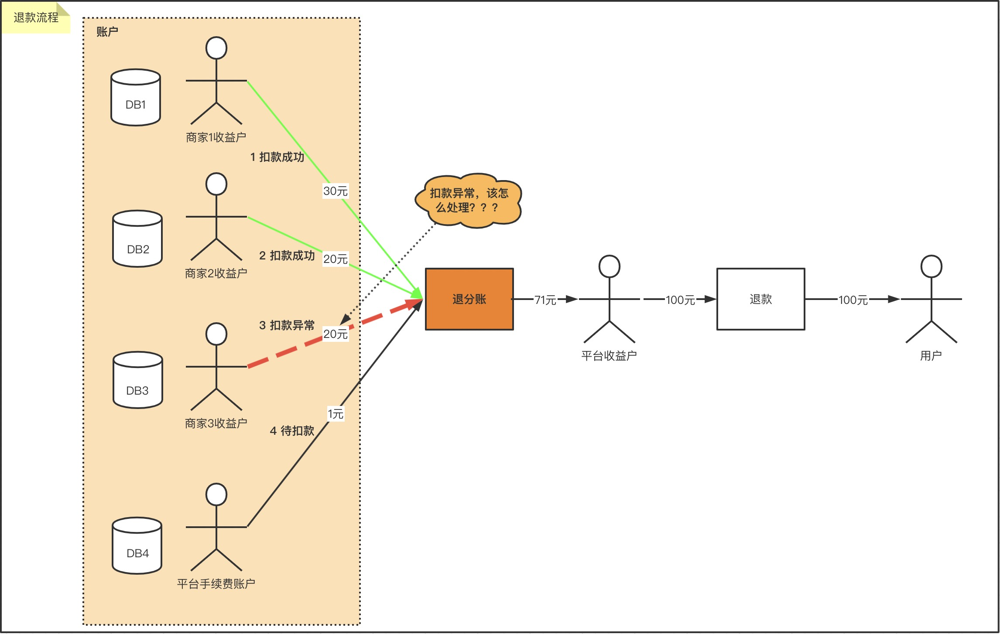

# TCC-TRANSACTION

## TCC-TRANSACTION是什么

[TCC-TRANSACTION](https://changmingxie.github.io)是一款开源的微服务架构下的TCC型分布式事务解决方案，致力于提供高性能和简单易用的分布式事务服务。

- Try: 尝试执行业务，完成所有业务检查（一致性），预留必须业务资源（准隔离性）
- Confirm: 确认执行业务，不作任何业务检查，只使用Try阶段预留的业务资源，满足幂等性
- Cancel: 取消执行业务，释放Try阶段预留的业务资源，满足幂等性

## 微服务架构中分布式事务问题

随着传统的单体架的构微服务化，原本单体架构中不同模块，被拆分为若干个功能简单、松耦合的服务。  
系统微服务化后，内部可能需要调用多个服务并操作多个数据库实现，服务调用的分布式事务问题变的非常突出。

比如支付退款场景需要从各分账方退回平台收益户(退分账)，再退还给付款方。其中**退分账**阶段，
涉及从多个分账方(商家1收益户，商家2收益户，商家3收益户，平台手续费账户)扣款，这些账户分布在不同数据库，
比如商家3收益户扣款失败，其他成功扣款需要回滚，这里需要分布式事务保证一致性。

## 如何解决

如何解决上面**退分账**中分布式事务问题呢？
选择使用tcc-transaction框架，执行流程如下：

- Try:  
  商家1收益户->冻结分账金额  
  商家2收益户->冻结分账金额  
  商家3收益户->冻结分账金额  
  平台手续费->冻结手续费
- Try成功 => Confirm:  
  商家1收益户->扣除分账金额  
  商家2收益户->扣除分账金额  
  商家3收益户->扣除分账金额  
  平台手续费->扣除手续费  
  平台收益户-> 增加金额(总分账金额+手续费)
- Try失败 => Cancel:   
  商家1收益户->解冻分账金额  
  商家2收益户->解冻分账金额  
  商家3收益户->解冻分账金额  
  平台手续费->解冻手续费

## 工作原理

第一阶段：主业务服务分别调用所有从业务的 try 操作，并在活动管理器中登记所有从业务服务。当所有从业务服务的 try 操作都调用成功或者某个从业务服务的 try 操作失败，进入第二阶段。    
第二阶段：活动管理器根据第一阶段的执行结果来执行 confirm 或 cancel 操作。    
如果第一阶段所有 try 操作都成功，则活动管理器调用所有从业务活动的 confirm操作。否则调用所有从业务服务的 cancel 操作。    
需要注意的是第二阶段 confirm 或 cancel 操作本身也是满足最终一致性的过程，在调用 confirm 或 cancel 的时候也可能因为某种原因（比如网络）导致调用失败，所以需要活动管理支持重试的能力，同时这也就要求
confirm 和 cancel 操作具有幂等性。

## 快速开始

[官网](https://changmingxie.github.io)    
[快速开始](https://changmingxie.github.io/zh-cn/docs/tutorial/quickstart.html)  
[最新可用版本2.x](https://changmingxie.github.io/zh-cn/blog/tcc-transaction-2.x-release.html)  

## 常见问题

[常见问题](https://changmingxie.github.io/zh-cn/docs/faq.html)

## 讨论群

钉钉扫码入群

