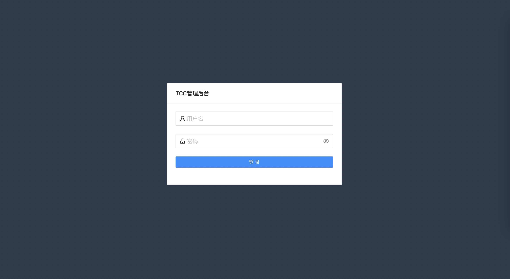
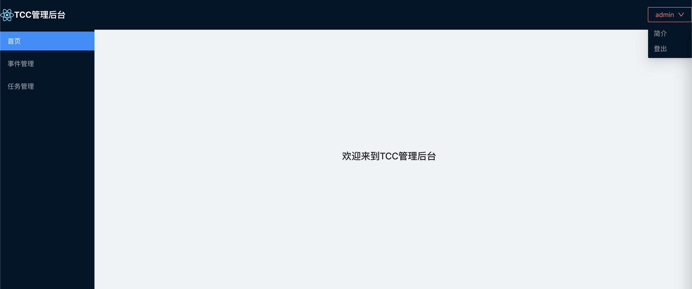
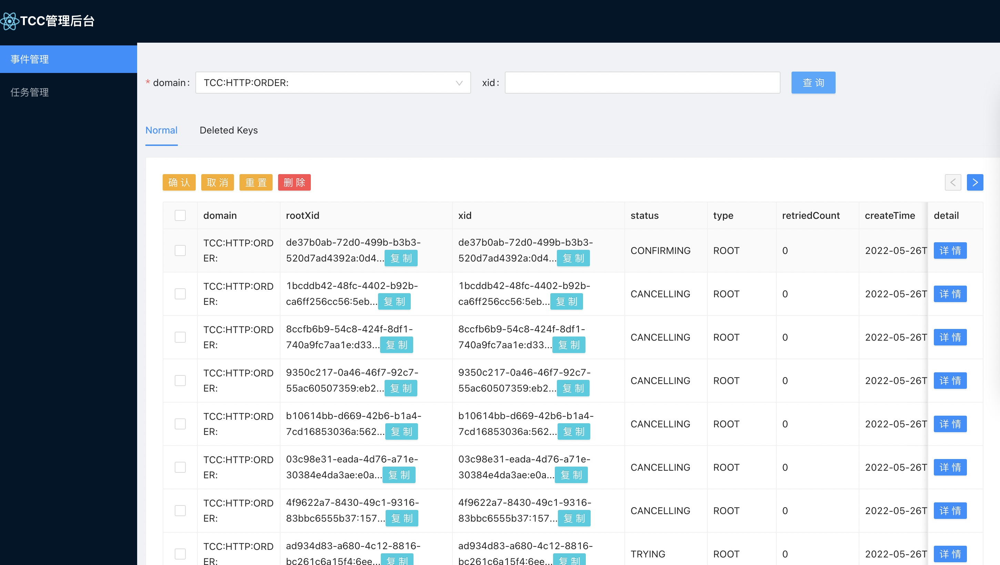
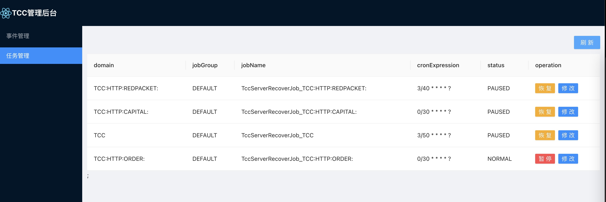

# 本地启动

## 1 启动服务tcc-transaction-server

## 2 启动服务tcc-transaction-dashboard

## 3 页面效果

### 访问地址

```
http://localhost:8888/tcc-transaction-dashboard
```

### 登录功能

#### 登录页

默认用户: admin 密码：123456    


#### 首页



### 事件管理



### 任务管理

  


